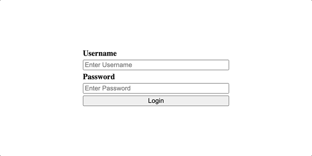

# Clojurescript AWS Amplify Authentication Hook With Helix

This is a small project to show you how to write an Authentication hook using
[Helix](https://github.com/lilactown/helix). For this particular demo we are
using AWS Amplify as the authentication provider. However, this hook could
be used with any other provider, such as Firebase.



## AWS Cognito Pool
In order for you to run this demo, you will need to have an [AWS Cognito](https://aws.amazon.com/cognito/)
authentication pool setup with a user to test with.

### Setup User Pool
Within your [AWS Console](https://console.aws.amazon.com/) navigate to the
Amazon Cognito Service. You will see User pools or Federated identities, for
this we are going to create a User Pool. As the console changes over time,
you may not have the exact same steps. We want to create a user pool, with no
MFA that has an application client.
- Be within the User pools area.
- Click `Create user pool`
  - Provider types should be `Cognito user pool`
  - For this sign-in options, you can select whichever you prefer. For this
    example we are going to be using username.
  - Once you have made your selection, click `Next`.
- Configure Security Requirements
  - Password policy, leave defaults.
  - Multi-factor authentication, use `No MFA`. This is for demo purposes
    only, you would most definitely want to enforce MFA for your users.
  - User account recovery, leave the defaults that are selected.
  - Click `Next`.
- Configure sign-up experience
  - Self-service sign-up, turn this off.
  - Attribute verification and user account confirmation, leave defaults.
  - Required attributes, add `name`. This will be the displayed name in the demo.
  - Click `Next`.
- Configure message delivery
  - Email provider, select `Send email with Cognito`. This is only recommended
    for the demo.
  - Leave all other settings as default, click `Next`.
- Integrate your app
  - user pool name, choose any name e.g `helix-auth-demo`.
  - Hosted authentication pages, leave defaults.
  - Initial app client
    - App type `Public client`
    - App client name, choose any name e.g `helix-auth-demo-app`
    - Client secret, `Don't generate a client secret`
  - Leave all other defaults, click `Next`.
- Review and create
  - Click `Create user pool`.

### Create Test User
Within your [AWS Console](https://console.aws.amazon.com/) navigate to the
Amazon Cognito Service. Click on the user pool that you want to test with.
You should see a list of Users, with the ability to create a new one.
You can create a new one by supplying a username and password and clicking
`Create user`. \
To set the `name` of the user, click on the user. Under `User attributes`,
click `Edit` and under `name` give a good display name, e.g `Elon Musk` and
an `email`.

#### Confirmation status
If the Confirmation Status for the user shows `Force change password`. You
can run the following command use the AWSCLI. As this workflow is out of
scope for this demo.
```bash
aws cognito-idp admin-set-user-password \
  --user-pool-id <your-user-pool-id> \
  --username <username> \
  --password <password> \
  --permanent
```
Once you have run the above, the Confirmation Status should change to `Confirmed`.

## Copy Cognito User Pool settings
Once you have a user pool and test user setup. You will just need to gather
the required settings to populate [auth_hook](./src/auth/auth_hook.cljs)
```clojure
(defonce aws-config
  (.configure Amplify
    (clj->js {:Auth {:region              "eu-west-1"
                     :userPoolId          "eu-west-1_X1ZeoVbgR"
                     :userPoolWebClientId "4el4qfb57cp2ircejtmriqql1n"}})))
```
Within your [AWS Console](https://console.aws.amazon.com/) navigate to the
Amazon Cognito Service. Click on the user pool that you want to test with.

Under `User pool overview`, you will see the `User pool ID` - this also starts
with the region that the pool is within. You can use that to populate the
`:region` and `:userPoolId`.

Under `App integration`, you will see an `App client list`. You will need to
use the `Client ID` within the `:userPoolWebClientId` for the app that was created
during the user pool setup.

## Running the Application
In order to run the application, clone the repository, update the [cognito pool settings](#copy-cognito-user-pool-settings)
and then run the following:
```bash
yarn # installs all dependencies
yarn dev
```
